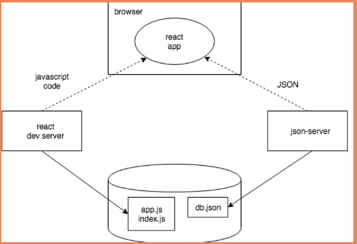

# <p style="text-align:center">Getting data from server</p>

We will now take a step in that direction by familiarizing ourselves with how the code executing in the browser communicates with the backend.

Going forward, the idea will be to save the notes to the server, which in this case means saving them to the json-server. The React code fetches the notes from the server and renders them to the screen. Whenever a new note is added to the application, the React code also sends it to the server to make the new note persist in "memory".

json-server stores all the data in the db.json file, which resides on the server. In the real world, data would be stored in some kind of database. However, json-server is a handy tool that enables the use of server-side functionality in the development phase without the need to program any of it.

## The browser as a runtime enviroment

Our first task is fetching the already existing notes to our React application from the address http://localhost:3001/notes.

In the part0 example project, we already learned a way to fetch data from a server using JavaScript. The code in the example was fetching the data using XMLHttpRequest, otherwise known as an HTTP request made using an XHR object. This is a technique introduced in 1999, which every browser has supported for a good while now.

The use of XHR is no longer recommended, and browsers already widely support the fetch method, which is based on so-called promises, instead of the event-driven model used by XHR.

**It is worth noting that the code in the event handler is defined before the request is sent to the server. Despite this, the code within the event handler will be executed at a later point in time. Therefore, the code does not execute synchronously "from top to bottom", but does so asynchronously. JavaScript calls the event handler that was registered for the request at some point.**

A synchronous way of making requests that's common in Java programming, for instance, would play out as follows (NB, this is not actually working Java code):

```jsx
HTTPRequest request = new HTTPRequest();

String url = "https://studies.cs.helsinki.fi/exampleapp/data.json";
List<Note> notes = request.get(url);

notes.forEach(m => {
  System.out.println(m.content);
});
```

In Java, the code executes line by line and stops to wait for the HTTP request, which means waiting for the command request.get(...) to finish. The data returned by the command, in this case the notes, are then stored in a variable, and we begin manipulating the data in the desired manner.

**In contrast, JavaScript engines, or runtime environments follow the asynchronous model. In principle, this requires all IO operations (with some exceptions) to be executed as non-blocking. This means that code execution continues immediately after calling an IO function, without waiting for it to return.**

When an asynchronous operation is completed, or, more specifically, at some point after its completion, the JavaScript engine calls the event handlers registered to the operation.

Currently, JavaScript engines are single-threaded, which means that they cannot execute code in parallel. As a result, it is a requirement in practice to use a non-blocking model for executing IO operations. Otherwise, the browser would "freeze" during, for instance, the fetching of data from a server.

Another consequence of this single-threaded nature of JavaScript engines is that if some code execution takes up a lot of time, the browser will get stuck for the duration of the execution. If we added the following code at the top of our application:

```jsx
setTimeout(() => {
  console.log('loop..')
  let i = 0
  while (i < 50000000000) {
    i++
  }
  console.log('end')
}, 5000)
```

everything would work normally for 5 seconds. However, when the function defined as the parameter for setTimeout is run, the browser will be stuck for the duration of the execution of the long loop. Even the browser tab cannot be closed during the execution of the loop, at least not in Chrome.

For the browser to remain responsive, i.e., to be able to continuously react to user operations with sufficient speed, the code logic needs to be such that no single computation can take too long.

[Videazo del event loop de JS](https://www.youtube.com/watch?v=8aGhZQkoFbQ)


## axios and promises

The documentation on Mozilla's site states the following about promises:

**A Promise is an object representing the eventual completion or failure of an asynchronous operation.**

In other words, a promise is an object that represents an asynchronous operation. A promise can have three distinct states:

* The promise is pending: It means that the final value (one of the following two) is not available yet.

* The promise is fulfilled: It means that the operation has been completed and the final value is available, which generally is a successful operation. This state is sometimes also called resolved.

* The promise is rejected: It means that an error prevented the final value from being determined, which generally represents a failed operation.

**If, and when, we want to access the result of the operation represented by the promise, we must register an event handler to the promise. This is achieved using the method then:**

```jsx
const promise = axios.get('http://localhost:3001/notes')

promise.then(response => {
  console.log(response)
})
```

**The JavaScript runtime environment calls the callback function registered by the then method providing it with a response object as a parameter. The response object contains all the essential data related to the response of an HTTP GET request, which would include the returned data, status code, and headers.**

Storing the promise object in a variable is generally unnecessary, and it's instead common to chain the then method call to the axios method call, so that it follows it directly:

```jsx
axios.get('http://localhost:3001/notes').then(response => {
  const notes = response.data
  console.log(notes)
})
```

**The data returned by the server is plain text, basically just one long string. The axios library is still able to parse the data into a JavaScript array, since the server has specified that the data format is application/json; charset=utf-8 (see the previous image) using the content-type header.**

We can finally begin using the data fetched from the server.

Let's try and request the notes from our local server and render them, initially as the App component. Please note that this approach has many issues, as we're rendering the entire App component only when we successfully retrieve a response:

```jsx
import ReactDOM from 'react-dom/client'
import axios from 'axios'
import App from './App'

axios.get('http://localhost:3001/notes').then(response => {
  const notes = response.data
  ReactDOM.createRoot(document.getElementById('root')).render(<App notes={notes} />)
})
```

This method could be acceptable in some circumstances, but it's somewhat problematic. Let's instead move the fetching of the data into the App component.

What's not immediately obvious, however, is where the command axios.get should be placed within the component.

## Effect hooks

>Effects let a component connect to and synchronize with external systems. This includes dealing with network, browser DOM, animations, widgets written using a different UI library, and other non-React code.

As such, effect hooks are precisely the right tool to use when fetching data from a server.

```jsx
import { useState, useEffect } from 'react'
import axios from 'axios'
import Note from './components/Note'

const App = () => {
  const [notes, setNotes] = useState([])
  const [newNote, setNewNote] = useState('')
  const [showAll, setShowAll] = useState(true)

  useEffect(() => {
    console.log('effect')
    axios
      .get('http://localhost:3001/notes')
      .then(response => {
        console.log('promise fulfilled')
        setNotes(response.data)
      })
  }, [])
  console.log('render', notes.length, 'notes')

  // ...
}
```

This is printed to the console:

```jsx
render 0 notes
effect
promise fulfilled
render 3 notes
```

First, the body of the function defining the component is executed and the component is rendered for the first time. At this point render 0 notes is printed, meaning data hasn't been fetched from the server yet.

The following function, or effect in React parlance:

```jsx
() => {
  console.log('effect')
  axios
    .get('http://localhost:3001/notes')
    .then(response => {
      console.log('promise fulfilled')
      setNotes(response.data)
    })
}
```

is executed immediately after rendering. The execution of the function results in effect being printed to the console, and the command axios.get initiates the fetching of data from the server as well as registers the following function as an event handler for the operation:

```jsx
response => {
  console.log('promise fulfilled')
  setNotes(response.data)
}
```

When data arrives from the server, the JavaScript runtime calls the function registered as the event handler, which prints promise fulfilled to the console and stores the notes received from the server into the state using the function setNotes(response.data).

**As always, a call to a state-updating function triggers the re-rendering of the component. As a result, render 3 notes is printed to the console, and the notes fetched from the server are rendered to the screen.**

Let's rewrite the code a bit differently.

```jsx
const hook = () => {
  console.log('effect')
  axios
    .get('http://localhost:3001/notes')
    .then(response => {
      console.log('promise fulfilled')
      setNotes(response.data)
    })
}

useEffect(hook, [])
```

Now we can see more clearly that the function useEffect takes two parameters. The first is a function, the effect itself. According to the documentation:

>By default, effects run after every completed render, but you can choose to fire it only when certain values have changed.

**So by default, the effect is always run after the component has been rendered. In our case, however, we only want to execute the effect along with the first render.**

**The second parameter of useEffect is used to specify how often the effect is run. If the second parameter is an empty array [], then the effect is only run along with the first render of the component.**

There are many possible use cases for an effect hook other than fetching data from the server. However, this use is sufficient for us, for now.

Think back to the sequence of events we just discussed. Which parts of the code are run? In what order? How often? Understanding the order of events is critical!

We still have a problem with our application. When adding new notes, they are not stored on the server.

## The development runtime enviroment


The configuration for the whole application has steadily grown more complex. Let's review what happens and where. The following image describes the makeup of the application

The JavaScript code making up our React application is run in the browser. The browser gets the JavaScript from the React dev server, which is the application that runs after running the command npm run dev. The dev-server transforms the JavaScript into a format understood by the browser. Among other things, it stitches together JavaScript from different files into one file. We'll discuss the dev-server in more detail in part 7 of the course.



The React application running in the browser fetches the JSON formatted data from json-server running on port 3001 on the machine. The server we query the data from - json-server - gets its data from the file db.json.

At this point in development, all the parts of the application happen to reside on the software developer's machine, otherwise known as localhost. The situation changes when the application is deployed to the internet. We will do this in part 3.


